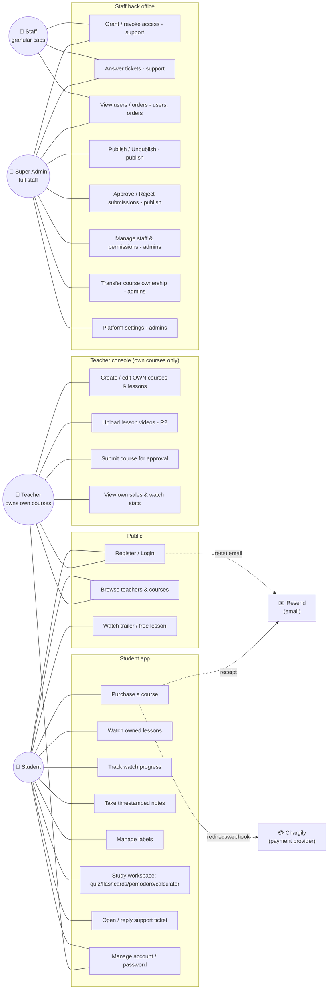
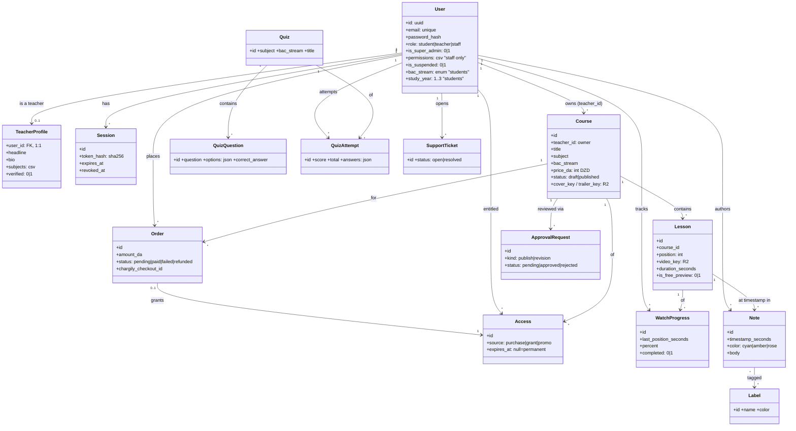
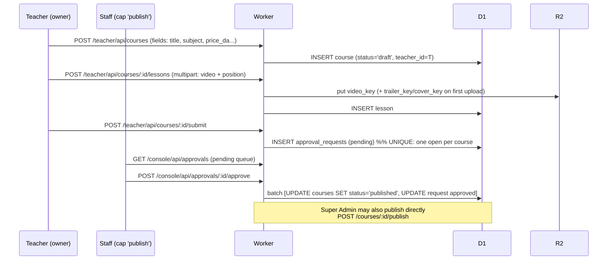
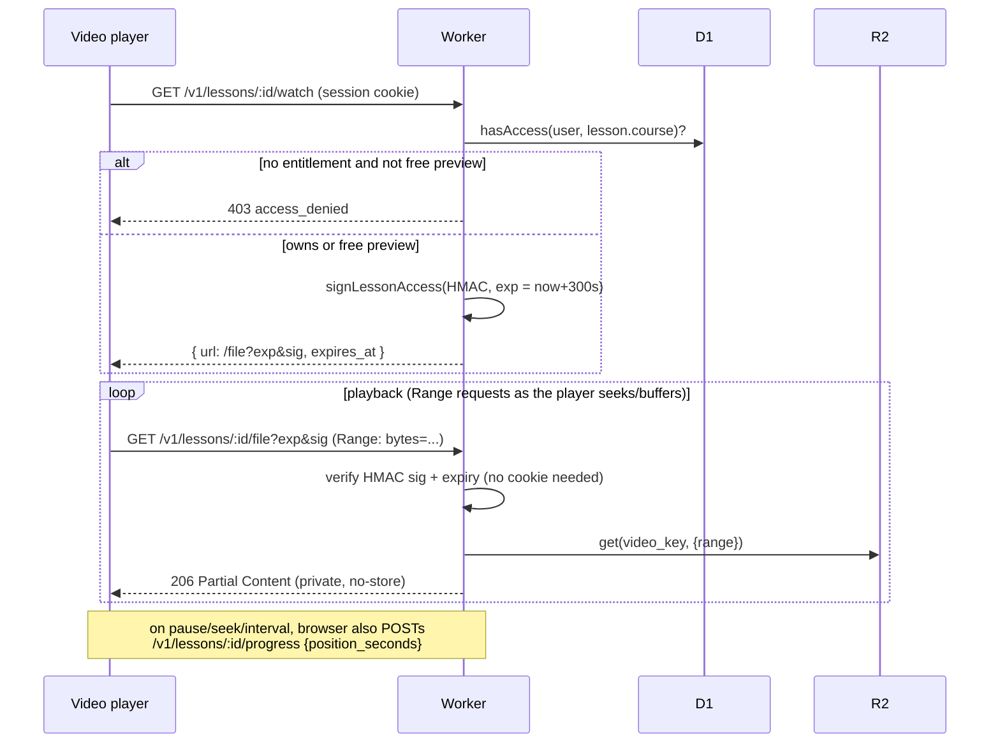
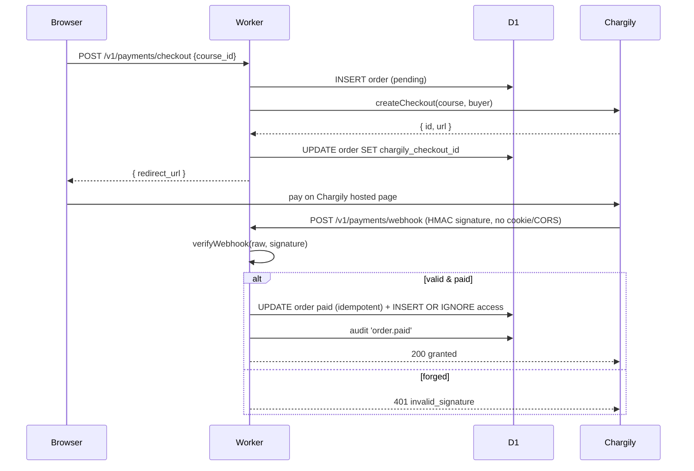
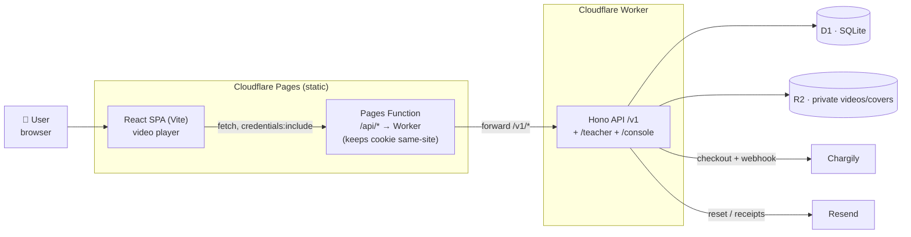

# EZBAC — Technical Architecture (Target)

> BAC exam-prep platform (Algeria) — **teacher video courses**, replacing the
> current link-aggregator prototype. This document is modeled directly on
> `L'Externe`'s production architecture (Cloudflare Worker + D1 + R2, RBAC,
> Chargily payments) and adapts it to ezbac's domain: **teachers sell video
> courses instead of publishers selling books.**
>
> Nothing in this document is built yet. Everything is **📐 Proposed** unless
> marked **✅ Exists today**. Section 0 is the only descriptive section; the
> rest is prescriptive — a target to build toward and negotiate, not a
> changelog.

> **⚠️ Pivot (2026-09-05): teachers no longer have accounts or a dashboard.**
> The original plan below modeled teachers as a first-class role who log in,
> create their own courses, upload their own lesson videos, and submit them
> for staff approval (§2.1 UC13–16, §5.6). That's been reversed: **teachers
> are now purely content-attribution records that staff create and manage.**
> There is no teacher login, no teacher-facing UI, and no self-serve teacher
> registration. Staff (via `/console`) creates the teacher record, creates the
> course, assigns it to that teacher, uploads every lesson video, sets the
> cover image, and publishes it — all from the same console. The mermaid
> diagrams and prose below still describe the original teacher-self-serve
> design in places (they weren't fully redrawn); treat any reference to a
> teacher "logging in," "uploading," or "submitting for review" as superseded
> by this note. §5.6 has the current, accurate shape of what staff can do.

---

## 0. Where ezbac stands today

| Layer | Today | Gap |
|---|---|---|
| Frontend | React 18 SPA on Vite, React Router, Tailwind, Arabic/French/English i18n (`LangContext`) | Solid base — keep it. |
| Hosting | Vercel, static `dist/` | No same-site API to pair with; no edge compute. |
| "Backend" | **None.** The browser calls Firestore directly (`firebase/firestore` client SDK) | No server-side validation, no RBAC, no payments, no signed file access, no rate limiting. |
| Auth | **None.** `/admin` is a single hardcoded password (`admin123`) compared in client JS (`src/pages/Admin.jsx`) | Visible in the shipped bundle; zero real accounts; no student login at all. |
| Content | `resources` Firestore collection: raw Google Drive / YouTube links pasted in by whoever has the admin password | No ownership, no access control, nothing ezbac actually hosts or can sell. |
| Payments | None | Can't sell anything. |
| Roles | None (one shared password) | No student / teacher / staff distinction. |

ezbac already has good bones on the **study-tools** side — quiz engine, flashcards, Pomodoro, a BAC grade calculator, games, and real i18n with the 8 BAC streams already enumerated in `Landing.jsx` (شعبة علوم تجريبية، رياضيات، تسيير و اقتصاد، اداب و فلسفة، لغات اجنبية، هندسة ميكانيكية/كهربائية/مدنية). Keep all of that. What's missing is everything L'Externe already has: **real accounts, a real content-owner role, a real payment flow, and a real video-serving layer.** That gap is what this document closes.

---

## Key decisions (read this before anything else)

These are the pivots that actually matter; everything else in this document follows from them. Flagging them up front so you can redirect before any of it gets built — several are hard to reverse once live.

| # | Decision | Recommendation | Why |
|---|---|---|---|
| 1 | Database | Move from Firestore → **Cloudflare D1 (SQLite)** | You can't do RBAC, ownership scoping, or atomic payment grants cleanly against open client-side Firestore rules. D1 + a real API is what makes "professional" true, not just styling. |
| 2 | Hosting | Move from Vercel → **Cloudflare Pages + a Hono Worker**, same split as L'Externe | Lets the frontend and API share one origin (via the same same-site proxy trick), and R2 + Workers is the natural place to stream video privately. |
| 3 | Content-owner role | New first-class **Teacher** role, distinct from internal **Staff/Admin** | L'Externe conflates "book owner" into its Admin role. Ezbac's teachers are external partners with public profiles — modeling them as a real role (not an internal capability) is more correct, not just a rename. |
| 4 | Video delivery | MVP: same pattern as L'Externe's PDFs — private R2 + 5-min HMAC-signed URL + HTTP Range streaming. **Cloudflare Stream is a later upgrade**, not a v1 requirement | Zero transcoding pipeline needed to launch; identical anti-piracy posture to what L'Externe already ships. |
| 5 | Migration | Additive, phased (§7) — the current Vercel/Firebase site keeps running until cutover | Firebase→D1 and Vercel→Pages are both hard-to-reverse; nothing here should be executed silently. |

---

## 1. The core pivot: Books → Teacher Video Courses

| L'Externe | ezbac equivalent |
|---|---|
| `Publisher` + `Book` (owned by an Admin via `created_by`) | **Teacher** (a real user role) owns **Course**s directly |
| One PDF per book (`pdf_key`) | One **Course** = an ordered list of **Lesson**s, each one video (`video_key`) |
| `preview_key` (separate sample PDF) | `trailer_key` on the course (short public teaser) **+** `is_free_preview` per lesson (usually lesson 1) |
| Reading progress (`last_page`) | Watch progress (`last_position_seconds`, per lesson) |
| Annotation on a PDF page/highlight | **Note** at a video timestamp |
| Admin with `books` capability | Not needed — ownership is just `course.teacher_id = user.id`, no capability grant required |
| — (not modeled) | **Quiz** engine, formalized (today's Firestore `quizzes` collection becomes real tables with tracked attempts) |

Everything else — RBAC shape, payments, audit logging, deployment pattern — carries over close to 1:1.

---

## 2. UML

### 2.1 Use Case Diagram



Notes:
- `publish` and `admins` are **Super-Admin-only** and never grantable, same rule as L'Externe. Grantable staff caps = `courses, users, orders, support`.
- Teachers are **not** part of the capability system at all — they only ever see courses where `teacher_id = self`. This is simpler than L'Externe's admin-ownership-scope because teachers never get broader grants.

### 2.2 Main Class / Entity Diagram



### 2.3 Key Sequence Diagrams

**(a) Authentication — login (cookie session)** — unchanged from L'Externe.

```mermaid
sequenceDiagram
  participant B as Browser (SPA)
  participant P as Pages Proxy /api/*
  participant W as Worker (Hono)
  participant D as D1
  B->>P: POST /api/v1/auth/login {email,password}
  P->>W: forward (same-origin cookie preserved)
  W->>D: SELECT user by email
  W->>W: verifyPassword (PBKDF2) — constant time
  alt suspended
    W-->>B: 403 account_suspended
  else valid
    W->>D: INSERT session (token_hash = sha256)
    W-->>B: Set-Cookie session=<raw>; HttpOnly; Secure; SameSite=Lax
    W->>D: audit_log 'user.login'
  end
```

**(b) Course creation → approval → publication**



**(c) Lesson playback (signed short-lived link + Range streaming)**



**(d) Payment (Chargily redirect + webhook)** — unchanged shape from L'Externe, `book_id` → `course_id`.



---

## 3. System Pipeline

### 3.1 High-level flow



**Why the proxy exists:** identical reasoning to L'Externe — a Pages-hosted static frontend and a `*.workers.dev` API are different sites, so a `SameSite=Lax` session cookie won't ride along on cross-site `fetch`. The Pages Function forwards `/api/*` so the browser only ever talks to one origin. Temporary by design — retired once a real custom domain makes both same-site.

### 3.2 Main workflows

| Workflow | Path | Enforcement |
|---|---|---|
| **Authentication** | `/v1/auth/register\|login\|logout\|me\|change-password\|request-reset\|reset` | Cookie session; PBKDF2; suspended accounts blocked; reset tokens hashed, 60-min TTL, single-use |
| **Course & lesson upload** | `POST /teacher/api/courses`, `POST /teacher/api/courses/:id/lessons` (multipart → R2 + D1 draft) | role=teacher + ownership (`teacher_id = self`) |
| **Approval / publication** | `submit` → `approval_requests` (one open per course) → Staff `approve`/`reject`, or Super Admin direct `publish`/`unpublish` | `publish` = Super-Admin-only |
| **Lesson playback** | `/v1/lessons/:id/watch` mints 5-min HMAC-signed link → `/file` streams R2 with Range | `requireAuth` + `hasAccess` (or `is_free_preview`); signature is the credential on `/file` |
| **Payment** | `/v1/payments/checkout` → Chargily → `/v1/payments/webhook` | Webhook HMAC-verified, idempotent, no cookie/CORS |
| **Study tools** | `/v1/quizzes`, `/v1/quizzes/:id/attempts` (server-tracked, new); Pomodoro/Calculator/Games stay 100% client-side, no backend needed | `requireAuth` for attempts; quizzes readable public |
| **Staff back office** | `/console/api/*` — overview, users, orders, access grant/revoke, approvals, staff, audit, tickets, settings | `requireStaff` + per-route `requireCap` + forced initial-password change |

---

## 4. Database Schema

Cloudflare **D1 / SQLite**, same conventions as L'Externe: TEXT UUID PKs, UTC TEXT timestamps, booleans as `INTEGER 0/1`, money as **whole Algerian dinars** (`price_da`), secrets/tokens stored **hashed**, enums enforced by `CHECK`, `updated_at` maintained by `AFTER UPDATE` triggers.

### 4.1 ERD

```mermaid
erDiagram
  users ||--o| teacher_profiles : "is a teacher"
  users ||--o{ sessions : has
  users ||--o{ courses : "owns (teacher_id)"
  users ||--o{ orders : places
  courses ||--o{ orders : for
  users ||--o{ access : entitled
  courses ||--o{ access : of
  orders ||--o| access : grants
  courses ||--o{ lessons : contains
  users ||--o{ watch_progress : tracks
  lessons ||--o{ watch_progress : of
  courses ||--o{ flashcards_premade : ships
  courses ||--o{ summaries_premade : ships
  users ||--o{ password_reset_tokens : requests
  users ||--o{ audit_log : actor
  users ||--o{ approval_requests : submits
  courses ||--o{ approval_requests : "reviewed (entity)"
  users ||--o{ notes : authors
  lessons ||--o{ notes : "at timestamp in"
  users ||--o{ labels : owns
  notes ||--o{ note_labels : tagged
  labels ||--o{ note_labels : groups
  users ||--o{ support_tickets : opens
  support_tickets ||--o{ ticket_messages : thread
  quizzes ||--o{ quiz_questions : contains
  quizzes ||--o{ quiz_attempts : attempted
  users ||--o{ quiz_attempts : attempts

  users {
    text id PK
    text email UK
    text password_hash
    text role "student|teacher|staff"
    int  is_super_admin
    text permissions "csv caps, staff only"
    int  is_suspended
    int  must_change_password
    text display_name
    text bac_stream "students only, 8 enum values"
    int  study_year "1..3, students only"
  }
  teacher_profiles {
    text user_id PK, FK
    text headline
    text bio
    text subjects "csv"
    int  verified
  }
  courses {
    text id PK
    text teacher_id FK "owner"
    text title
    text subject
    text bac_stream
    int  price_da "DZD"
    text status "draft|published"
    text cover_key "R2"
    text trailer_key "R2, public teaser"
    text description
  }
  lessons {
    text id PK
    text course_id FK
    int  position
    text title
    text video_key "R2, private"
    int  duration_seconds
    int  is_free_preview
  }
  orders {
    text id PK
    text user_id FK
    text course_id FK
    int  amount_da
    text status "pending|paid|failed|refunded"
    text chargily_checkout_id
    text paid_at
  }
  access {
    text id PK
    text user_id FK
    text course_id FK
    text order_id FK
    text source "purchase|grant|promo"
    text expires_at "null=permanent"
  }
  sessions {
    text id PK
    text user_id FK
    text token_hash UK "sha256"
    text expires_at
    text revoked_at
  }
  watch_progress {
    text id PK
    text user_id FK
    text lesson_id FK
    int  last_position_seconds
    real percent
    int  completed
  }
  approval_requests {
    text id PK
    text entity_type "course"
    text entity_id
    text kind "publish|revision"
    text status "pending|approved|rejected"
    text payload "json"
    text submitted_by FK
    text reviewed_by FK
  }
  notes {
    text id PK
    text user_id FK
    text lesson_id FK
    int  timestamp_seconds
    text color "cyan|amber|rose"
    text body
    int  favorite
  }
  labels {
    text id PK
    text user_id FK
    text name "unique per user, NOCASE"
    text color
  }
  note_labels {
    text note_id PK, FK
    text label_id PK, FK
  }
  flashcards_premade { text id PK  text course_id FK  text question  text answer  int position }
  summaries_premade  { text id PK  text course_id FK  text content  int position }
  quizzes {
    text id PK
    text subject
    text bac_stream
    text study_year
    text title
  }
  quiz_questions {
    text id PK
    text quiz_id FK
    text question
    text options "json, 4 choices"
    text correct_answer
    int  position
  }
  quiz_attempts {
    text id PK
    text user_id FK
    text quiz_id FK
    int  score
    int  total
    text answers "json"
    text completed_at
  }
  password_reset_tokens {
    text id PK
    text user_id FK
    text token_hash "sha256"
    text expires_at
    text used_at
  }
  audit_log {
    text id PK
    text user_id FK
    text action
    text entity_type
    text entity_id
    text metadata "json"
  }
  settings { text key PK  text value  text updated_by FK }
  support_tickets {
    text id PK
    text user_id FK
    text subject
    text priority "low|medium|high"
    text status "open|resolved"
  }
  ticket_messages {
    text id PK
    text ticket_id FK
    text author "student|staff|note"
    text author_id FK
    text body
  }
```



### 4.2 Notable constraints

- `users.email` **UNIQUE**; `role IN ('student','teacher','staff')`. Super Admin is a **flag** (`is_super_admin`) on a staff account, not a role value — teachers can never hold it.
- `access UNIQUE(user_id, course_id)` — one entitlement per user/course; drives idempotent `INSERT OR IGNORE` on payment grant.
- `watch_progress UNIQUE(user_id, lesson_id)` — drives an `ON CONFLICT` upsert on every progress ping.
- `approval_requests` **partial unique index** `WHERE status='pending'` — at most **one open request per course**.
- `notes.body` **NOT NULL** — a note always carries text.
- `labels UNIQUE(user_id, name COLLATE NOCASE)`.
- `note_labels.label_id ON DELETE CASCADE` — deleting a label detaches but never deletes notes.
- `lessons UNIQUE(course_id, position)` — stable, gap-free lesson ordering per course.
- `sessions.token_hash` / `password_reset_tokens.token_hash` store **SHA-256**, never the raw token.

---

## 5. Additional Information

### 5.1 Authentication & RBAC
- **Sessions:** random high-entropy token in an `httpOnly; Secure; SameSite=Lax` cookie (30-day TTL); DB stores only its SHA-256. Logout/password-change revoke sessions. Passwords use **PBKDF2-HMAC-SHA256** chained to ~600k iterations (Workers caps a single call at 100k). Login is constant-time with a generic error (no user enumeration). This fully replaces today's client-side `admin123` check.
- **RBAC:** single decision function `can(staffUser, capability)`. Capabilities: `view, courses, users, orders, support, publish, admins`. `is_super_admin=1` ⇒ all. `publish` & `admins` are Super-Admin-only; grantable set = `courses, users, orders, support`.
- **Teacher ownership** is a separate, simpler check: `course.teacher_id === user.id`. No capability grants apply to teachers — they never see `/console`.

### 5.2 Storage
- **D1** (SQLite) for all relational data.
- **R2** private bucket (`FILES`): full lesson videos (`videos/{lessonId}.mp4`), course covers (`covers/{courseId}.jpg`), and **separate public teaser clips** (`trailers/{courseId}.mp4`). The bucket is never public — covers/trailers stream through the Worker; full lessons are reachable **only** via a short-lived HMAC-signed link with byte-range streaming, exactly like L'Externe's PDFs. The full video is never transcoded/derived at request time in the MVP (anti-piracy).
- **⚠️ Planned upgrade:** swap the R2-Range MVP for **Cloudflare Stream** once catalogue size or bandwidth justifies it — automatic adaptive-bitrate HLS, signed playback tokens, thumbnail sprites, watch analytics. The access-control model (`hasAccess` → mint a short-lived credential) doesn't change, only what it signs.

### 5.3 Payment system
- **Chargily** (Algerian gateway), same `PaymentProvider` interface as L'Externe (`createCheckout` + `verifyWebhook`). `getPaymentProvider()` selects Chargily when `CHARGILY_SECRET_KEY` is set, else a **stub** (local/dev). Webhook is HMAC-authenticated, idempotent, grants `access` on `paid`. Staging stays test-mode forever; live mode exists only under `env.production`.

### 5.4 External APIs / services
- **Chargily** — payments.
- **Resend** — transactional email (reset links, purchase receipts); no-op if `RESEND_API_KEY` unset.

### 5.5 Deployment architecture
- **Frontend:** Cloudflare **Pages** project `ezbac` (static Vite `dist/` + the `/api/*` proxy Function). `main` → production, branches → preview (preview points at the **staging** Worker).
- **API:** Cloudflare **Worker**, two environments in one `wrangler.jsonc`: top-level = **staging** (test keys), `env.production` = live. No bare `deploy` script — production is always `deploy:production`. Separate D1 databases and R2 buckets per environment. Secrets via `wrangler secret put` only.

### 5.6 Staff console — course, lesson & teacher management — ✅ scaffolded

**Superseded from the original teacher-self-serve design** (see the pivot note at the top of this document). There is no teacher login and no teacher-facing UI at all anymore — `src/pages/teacher/` and `api/src/routes/teacher.ts` were deleted outright, not just hidden. Public self-registration (`POST /v1/auth/register`) only ever creates `role='student'` accounts now. Everything content-related is managed by staff at `/console`, backed by `api/src/routes/console.ts`:

| Page | Route | What it does |
|---|---|---|
| **Courses** | `/console` (index) | Every course platform-wide, any teacher, any status — filterable by Draft/Pending/Published. Inline **Approve**/**Reject** for anything still in the (now rarely-used) approval queue, and a direct **Publish**/**Unpublish** toggle that bypasses it entirely. "+ New course" creates a course from scratch, owner picked from a teacher dropdown. |
| **Course form** | `/console/courses/new`, `/console/courses/:id` | Title, subject, BAC stream, price, description, **teacher reassignment** (any course can be moved to a different teacher), cover image upload, and a full **lesson manager**: add a lesson (title + video file → streamed straight into R2), reorder with up/down `PATCH`, delete (removes the D1 row and the R2 object). This is the direct replacement for the old teacher lesson-upload flow — same underlying mechanics, staff-operated instead of ownership-gated. |
| **Teachers** | `/console/teachers` | Every teacher record, course/published counts, a "Mark verified" toggle, and **"+ New teacher"** — staff creates the account directly (name, email, a password nobody ever needs to use since there's no teacher login surface to use it on, headline, subjects). This is the only way a teacher record comes into existence now. |

Teachers still live in the `users` table (`role='teacher'`) with a `teacher_profiles` row, purely so `courses.teacher_id` keeps a working foreign key and existing queries (public catalogue's `teacher_name` join, Library's teacher directory) don't need to change — but nothing ever authenticates as that row. No schema migration was needed for this pivot.

**Verified locally end-to-end** (`wrangler dev` + local D1/R2): staff creates a teacher → creates a course assigned to them → uploads a lesson video directly from the console → publishes it → the course appears in the public catalogue → the free-preview lesson plays back through the signed, range-streamed URL, all without any teacher-role session ever existing.

**Second entry point — the legacy `/admin` CMS page also does this, combined into one form.** Staff explicitly asked for teacher+course+video entry to live in `/admin`'s existing sidebar (next to Add Quiz/Add Flashcard/Add Resource), not only in `/console`. `src/pages/Admin.jsx` now:
- Gates on a **real** staff session (`useAuth()` + `api.login()`, rejecting anything where `role !== 'staff'`) instead of the old hardcoded `admin123` string compare.
- Adds an **"➕ Add Course"** tab: one form collecting teacher first/last name + email, course title/subject/BAC-stream/price/description, and a first lesson (title + video file + free-preview checkbox), plus a "publish immediately" checkbox (checked by default).
- Submits via a new endpoint, `POST /console/api/courses/with-teacher` (`api/src/routes/console.ts`, validated by `courseWithTeacherSchema` in `api/src/validation.ts`) — **finds-or-creates the teacher by email** (no teacher picker on this page), then creates the course, then (if a video was attached) `POST .../lessons`, then optionally `POST .../publish`. Same underlying console API and R2 mechanics as the `/console/courses/new` flow above — this is just a second, more streamlined client for it.
- **Verified locally end-to-end** through the actual UI: logged in as the seeded `staff@example.com` account, filled the combined form with a real video file (synthetic `DataTransfer` upload), submitted, and confirmed all three requests (`with-teacher` → 201, `lessons` → 201, `publish` → 200) succeeded and the course appeared in `GET /v1/courses`. Test rows were deleted from local D1 afterward.
- Footer's "Admin Dashboard" link (`src/components/Footer.jsx`) points at `/admin` again (was briefly changed to `/console` before this correction).

**`/console` retired — everything folded into `/admin`** (2026-09-05, explicit user request: "localhost:5173/console and localhost:5173/console/teachers gotta be part of localhost:5173/admin"). The separate staff console SPA (`ConsoleLayout`, `ConsoleCourses`, `ConsoleCourseForm`, `ConsoleTeachers` under `src/pages/console/`) is deleted outright — not hidden. `/admin` gained two more sidebar tabs, both new local components living directly in `src/pages/Admin.jsx` (no more nested routing needed, since Admin.jsx is already a single-page, tab-switched CMS):
- **"📚 Courses"** (`CoursesPanel`) — every course platform-wide, filterable by Draft/Pending/Published, inline Approve/Reject for the approval queue, Publish/Unpublish toggle, "Edit" opens **"CourseEditPanel"** inline (not a route) with the full course-details form, teacher reassignment dropdown, cover-image upload, and the complete lesson manager (add/reorder/delete) — same backend calls as before, just addressed by local component state (`editId`) instead of a URL param.
- **"👩‍🏫 Teachers"** (`TeachersPanel`) — every teacher account, course/published counts, "+ New teacher" form, verify toggle, and per-teacher "Change photo" avatar upload.

`App.jsx` no longer imports or routes anything under `/console` — that path now falls through to the catch-all (Landing page), exactly like any other unknown URL. `Login.jsx`'s post-login redirect for staff now goes to `/admin` instead of `/console`. All backend endpoints are unchanged (`/console/api/*` is the API's URL prefix, unrelated to the deleted frontend route) — this was purely a frontend consolidation, one admin surface instead of two.

**"Users" tab — account counts.** `GET /console/api/users/stats` (`users` cap) returns total users, counts by role (student/teacher/staff), suspended count, and new-signups in the last 7/30 days. `/admin` shows this as a stat-card grid (`UsersPanel`). Counts only, by design — no per-user list or management, since that wasn't asked for.

**Teacher photo, alongside the existing course cover image.** `teacher_profiles` gained an `avatar_key TEXT` column (`api/migrations/0003_teacher_avatar.sql`), mirroring `courses.cover_key`. Same R2 mechanics both ways: `POST /console/api/teachers/:id/avatar` (staff-only, `users` cap) stores to `avatars/{teacherId}.jpg` and updates the row; the public `GET /v1/teachers/:id/avatar` (`api/src/routes/courses.ts`) serves it back, 404s if unset. The `/admin` combined Add Course form now has two optional file inputs — teacher photo and course cover — uploaded right after the teacher/course rows are created (same request sequence as the lesson video). `/console/teachers` (`ConsoleTeachers.jsx`) shows each teacher's photo with an inline "Change photo" upload, and both public course surfaces (`Courses.jsx` catalogue cards, `CourseDetail.jsx`'s instructor card) now try the real photo first with a same-element `` that hides itself back down to the initials-circle fallback if there isn't one — no extra API flag needed to know whether a photo exists, the browser just finds out. Verified via the real `/admin` form end-to-end: uploaded both images alongside a video, and all three (avatar/cover/lesson) plus publish returned success; images rendered on `/courses`, `/courses/:id`, and `/console/teachers`; the still-photoless teacher on the same catalogue page correctly kept showing initials.

---

## 6. Visual / UI-UX direction

The Figma reference (`BluxTech Agency Website Template`) could not actually be rendered in this session — I got the Figma editor chrome, not the design canvas itself, and had no way to open it in a real browser either. **Everything below is a general "modern agency site" direction, not something pulled from your specific Figma frames.** Treat it as a starting point to compare against the real file yourself, not as a verified spec.

Conventions typical of this genre of template, mapped onto ezbac's existing brand (`#AB1017` red/maroon family, Outfit/Poppins/DM Sans, already-decent rounded-card dashboard):

| Section | Today | Direction |
|---|---|---|
| Hero | Big headline + CTA + illustration — ✅ already close | Keep; add a trust strip under it ("X courses · Y teachers · Z students") |
| Subject/stream chips | ✅ exists (`fields` array) | Keep as-is, it's already a clean pattern |
| "Services" icon grid | Placeholder icons reused across cards (several literally share `resume.svg`) | Give each real feature its own icon; this grid is also where "Teachers" and "Courses" become real nav entries, not placeholders |
| About cards | ✅ decent 4-card grid | Keep layout, retarget copy to the course marketplace |
| **Teachers grid** | Doesn't exist | **New** — photo, name, subject(s), rating, course count. This is the section that actually delivers "videos for teachers" instead of being just a schema change. |
| Course catalogue | `Library.jsx` lists raw Drive/YouTube links | Replace with real course cards: cover image, teacher name, price, stream/subject tag, free-preview badge |
| Testimonials | Doesn't exist | **New** — standard in agency templates, useful social proof for a paid product |
| FAQ | ✅ exists, keep | — |
| CTA banner | Currently a "coming soon" dead button | Make it a real newsletter or contact-us CTA — not a teacher-signup form, teachers no longer self-register (§5.6) |
| Footer | ✅ exists (dark maroon), keep | — |
| Course player (app) | Doesn't exist | **New, essential** — video on one side, a timestamped-notes panel on the other, mirroring L'Externe's reading workspace |
| RTL | ✅ `LangContext` exists | Make sure new sections (teacher grid, course cards, player) are actually mirrored in Arabic, not just text-flipped — agency templates are almost always designed LTR-first |

---

## 7. Proposed repo structure

Revised from the original nested `web/`/`api/` proposal: the frontend stays exactly where it already lives (`src/`, `public/`, `vite.config.js` unchanged) to avoid a disruptive relocation of a working app. `api/` is added as a new sibling folder.

```
ezbac/
├── src/                             # frontend — unchanged location (existing Vite + React app)
│   ├── pages/
│   │   ├── console/                 # ✅ scaffolded — ConsoleLayout, ConsoleCourses, ConsoleCourseForm, ConsoleTeachers
│   │   └── ...                      # existing: Landing, Library, Quiz, Flashcard, Pomodoro, Calculator, Games, Admin, Courses, CourseDetail
│   ├── components/
│   ├── contexts/                    # LangContext (existing) + AuthContext (✅ scaffolded)
│   └── lib/                         # ✅ scaffolded — api.js client
├── api/                             # ✅ scaffolded — Cloudflare Worker (Hono)
│   ├── src/
│   │   ├── routes/                  # ✅ auth, courses, console (course/lesson/teacher CRUD, publish, approvals)  ·  📐 payments, quizzes, support (not yet wired)
│   │   ├── lib/                     # password, sessions, permissions, r2
│   │   └── validation.ts            # Zod schemas
│   ├── migrations/                  # D1 SQL migrations
│   └── wrangler.jsonc
├── legacy/                          # today's static prototype — untouched
└── EZBAC_TECHNICAL_ARCHITECTURE.md  # this file
```

The staff console (courses, lessons, teachers) is now the primary content-management surface — see §5.6. Payments and quizzes-as-D1-routes remain **📐 Proposed**. Verified vertical slice: staff login → create a teacher → create a course assigned to them → upload lessons directly → publish → the course becomes visible in the public catalogue.

---

## 8. Migration plan

Additive and phased — the current Vercel/Firebase site keeps serving real users, untouched, until each phase is verified.

1. **Scaffold `api/`** — Hono + D1 + R2 locally, staging Worker + staging D1 stood up. Nothing switches over yet.
2. **Auth & RBAC** — users/sessions tables, register/login/reset routes; this is what finally retires the hardcoded `admin123` check.
3. **Content model** — teacher onboarding, course/lesson CRUD, R2 upload, approval workflow. Existing `resources` Firestore docs are just pasted links with no owner or video — plan to hand-curate which ones become seed courses rather than auto-migrating them.
4. **Payments** — Chargily checkout + webhook + access grants.
5. **Study tools** — port quiz/flashcards to D1-backed routes with real `quiz_attempts`; Pomodoro/Calculator/Games need no backend change, they stay client-only.
6. **Cutover** — point DNS/Pages at the new frontend; export Firestore data before retiring the Firebase project and the Vercel project.

Steps 6 (and the Vercel/Firebase retirement inside it) are exactly the kind of hard-to-reverse, whole-system change that should be confirmed explicitly when you're actually ready to execute it, not bundled into "build the new thing."

---

## 9. Open decisions / risks

1. **Video storage cost at scale.** R2 has no egress fee, which is why this pattern is affordable — but confirm expected catalogue size × average lesson length before committing to MVP-tier (non-transcoded) storage; very large files stream less smoothly without HLS.
2. **Teacher payouts** are out of scope above (only `access`/`orders` are modeled, same as L'Externe has no refund-money flow implemented) — if teachers need to be paid out a revenue share, that's a separate ledger/payout system to design later.
3. **Data migration from Firestore** — the `resources` collection is unowned link aggregation, not licensed video content, so there's no clean 1:1 migration; treat it as reference material for seeding the first real courses, not as data to script-migrate.
4. **Figma fidelity** — §6 is a general direction, not verified against the actual BluxTech frames (see the note at the top of that section). Confirm against the real file before it drives implementation.
